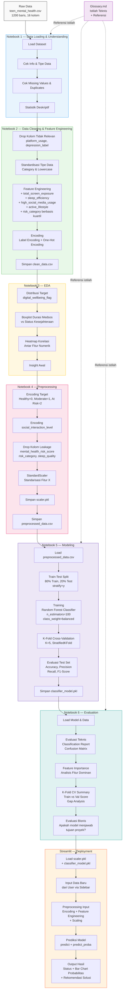

```mermaid
flowchart TD
    A[Raw Data\nteen_mental_health.csv\n1200 baris, 16 kolom] --> B

    subgraph NB1["Notebook 1 — Data Loading & Understanding"]
        B[Load Dataset] --> C[Cek Info & Tipe Data]
        C --> D[Cek Missing Values & Duplicates]
        D --> E[Statistik Deskriptif]
    end

    E --> F

    subgraph NB2["Notebook 2 — Data Cleaning & Feature Engineering"]
        F[Drop Kolom Tidak Relevan\nplatform_usage, depression_label] --> G
        G[Standardisasi Tipe Data\nCategory & Lowercase] --> H
        H[Feature Engineering\n+ total_screen_exposure\n+ sleep_efficiency\n+ high_social_media_usage\n+ active_lifestyle\n+ risk_category berbasis kuartil] --> I
        I[Encoding\nLabel Encoding + One-Hot Encoding] --> J
        J[Simpan clean_data.csv]
    end

    J --> K

    subgraph NB3["Notebook 3 — EDA"]
        K[Distribusi Target\ndigital_wellbeing_flag] --> L
        L[Boxplot Durasi Medsos\nvs Status Kesejahteraan] --> M
        M[Heatmap Korelasi\nAntar Fitur Numerik] --> N
        N[Insight Awal]
    end

    N --> O

    subgraph NB4["Notebook 4 — Preprocessing"]
        O[Encoding Target\nHealthy=0, Moderate=1, At Risk=2] --> P
        P[Encoding social_interaction_level] --> Q
        Q[Drop Kolom Leakage\nmental_health_risk_score\nrisk_category, sleep_quality] --> R
        R[StandardScaler\nStandarisasi Fitur X] --> S
        S[Simpan scaler.pkl] --> T
        T[Simpan preprocessed_data.csv]
    end

    T --> U

    subgraph NB5["Notebook 5 — Modeling"]
        U[Load preprocessed_data.csv] --> V
        V[Train-Test Split\n80% Train, 20% Test\nstratify=y] --> W
        W[Training\nRandom Forest Classifier\nn_estimators=100\nclass_weight=balanced] --> X
        X[K-Fold Cross-Validation\nK=5, StratifiedKFold] --> Y
        Y[Evaluasi Test Set\nAccuracy, Precision\nRecall, F1-Score] --> Z
        Z[Simpan classifier_model.pkl]
    end

    Z --> AA

    subgraph NB6["Notebook 6 — Evaluation"]
        AA[Load Model & Data] --> AB
        AB[Evaluasi Teknis\nClassification Report\nConfusion Matrix] --> AC
        AC[Feature Importance\nAnalisis Fitur Dominan] --> AD
        AD[K-Fold CV Summary\nTrain vs Val Score\nGap Analysis] --> AE
        AE[Evaluasi Bisnis\nApakah model menjawab\ntujuan proyek?]
    end

    AE --> AF
    GL[Glossary.md\nIstilah Teknis\n+ Referensi]

    subgraph DEPLOY["Streamlit — Deployment"]
        AF[Load scaler.pkl\n+ classifier_model.pkl] --> AG
        AG[Input Data Baru\ndari User via Sidebar] --> AH
        AH[Preprocessing Input\nEncoding + Feature Engineering\n+ Scaling] --> AI
        AI[Prediksi Model\npredict + predict_proba] --> AJ
        AJ[Output Hasil\nStatus + Bar Chart Probabilitas\n+ Rekomendasi Solusi]
    end

    GL -.->|Referensi istilah| NB1
    GL -.->|Referensi istilah| NB5
    GL -.->|Referensi istilah| NB6

    style A fill:#f9f9f9,stroke:#333
    style NB1 fill:#e8f4fd,stroke:#2196F3
    style NB2 fill:#e8f8e8,stroke:#4CAF50
    style NB3 fill:#fff8e1,stroke:#FFC107
    style NB4 fill:#fce4ec,stroke:#E91E63
    style NB5 fill:#ede7f6,stroke:#673AB7
    style NB6 fill:#e0f2f1,stroke:#009688
    style GL fill:#f3e5f5,stroke:#9C27B0
    style DEPLOY fill:#fff3e0,stroke:#FF5722
```